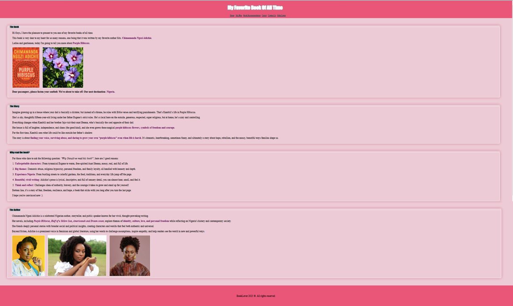

# My Favorite Book Project

## Description

This little project helps you create a simple web page using HTML & CSS.The goal here is to play with the HTML Elements and CSS slectors to create a beautiful web page where you can present something that is dear to your heart... or not.

I'm a big book lover so I presented my favorite book of all time,but if you're not into books, that's ok. Just make this project your own and present whatever it is that you're interested in (your favorite video game, your dog, your favorite actor...).

<b><i>If you're a beginner, this project is for you!!!</i></b>

Here's what my web page looks like:  

## Installation
The good thing with this project is that it's simple to run in your local environment. All you need is a web browser. Let me guide you through the "installation" process.

1. Clone this repository
2. Go to the project folder and open the index.html file with your favorite browser.
3. Voilà! The web page is displayed in your web browser.

## Customization
This is the fun part! I recommend you to do it to test and learn new stuff. All you have to do is play with the HTML elements and CSS selectors. Change the colors, add more divs, add a video, create a form... it's really up to you.

Hope this little project will be as fun to you as it was to me.
